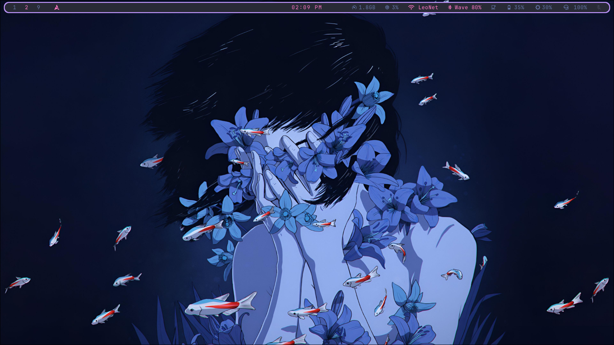
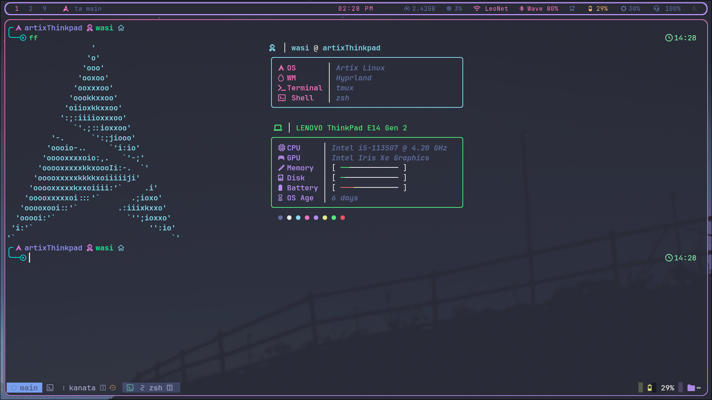
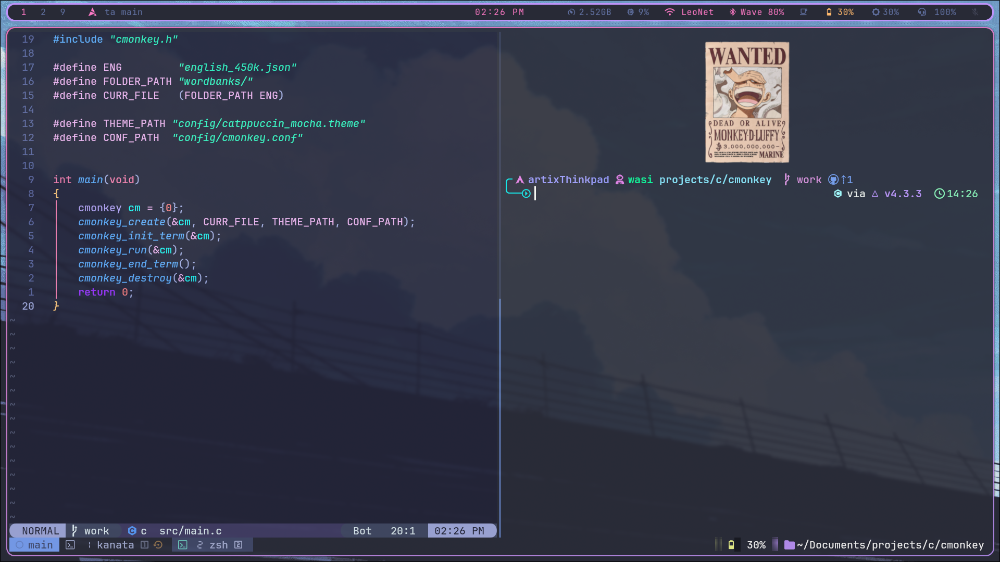
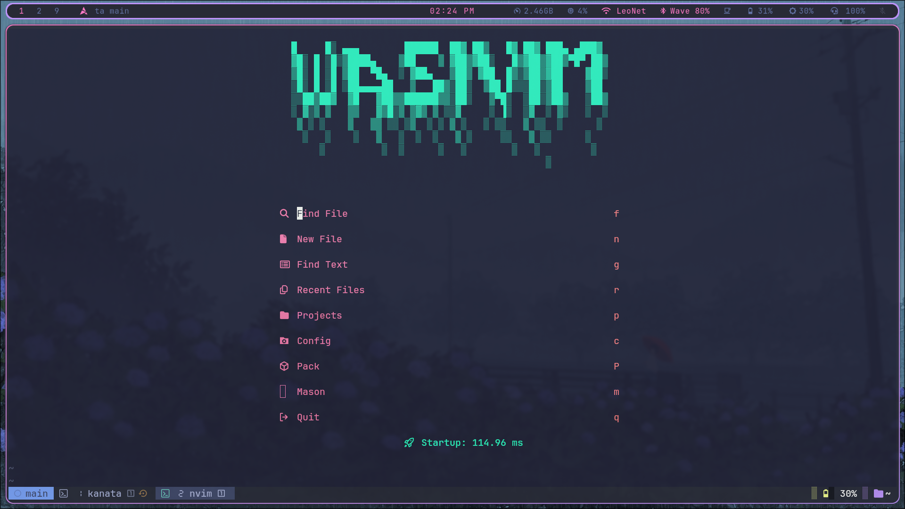
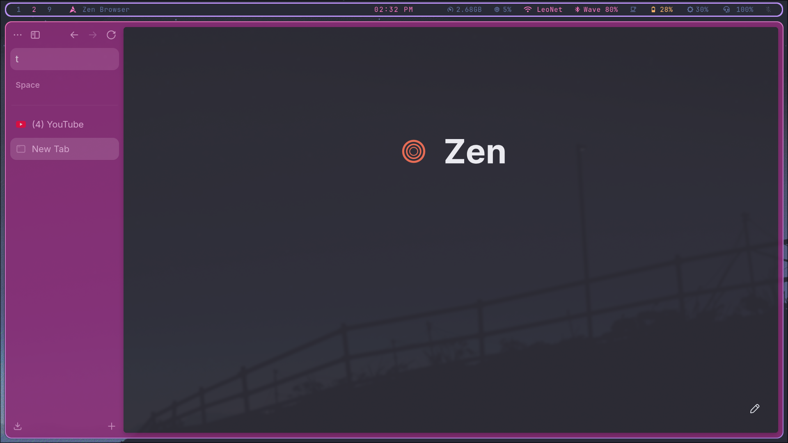
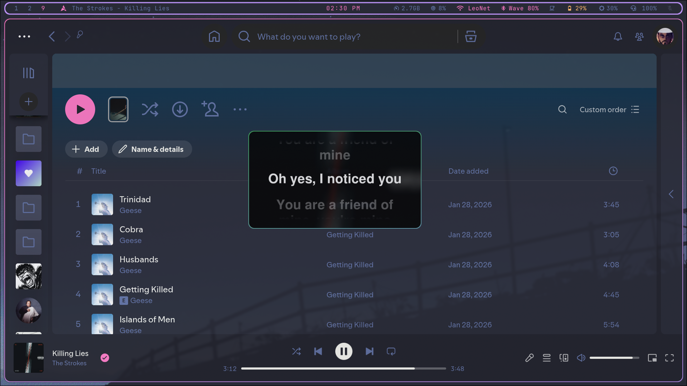
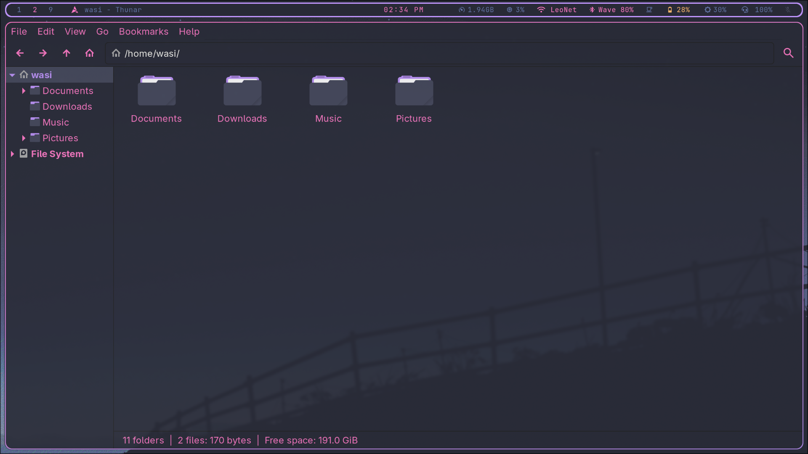
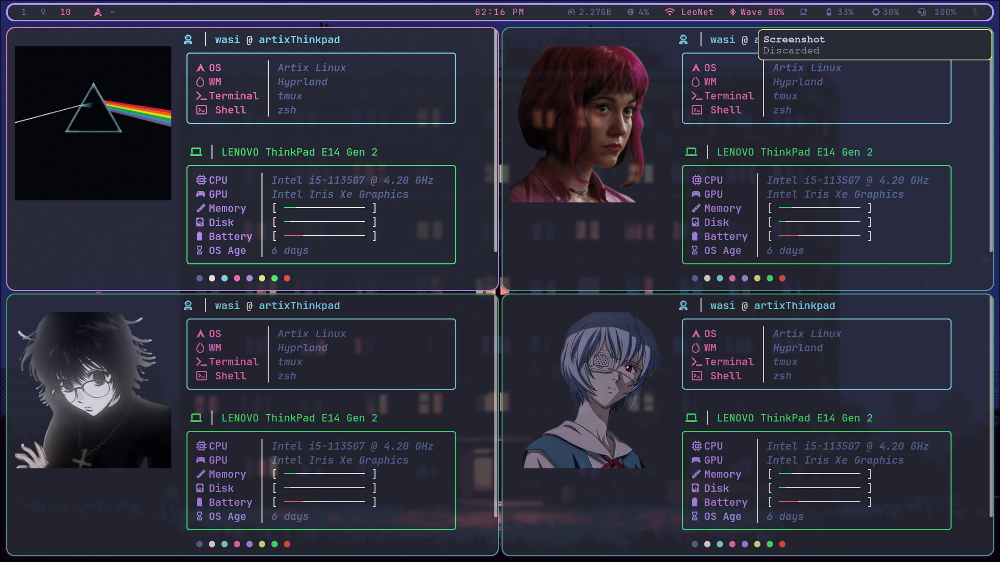
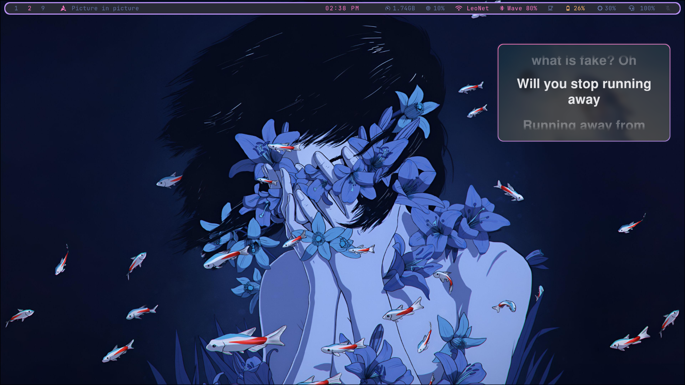
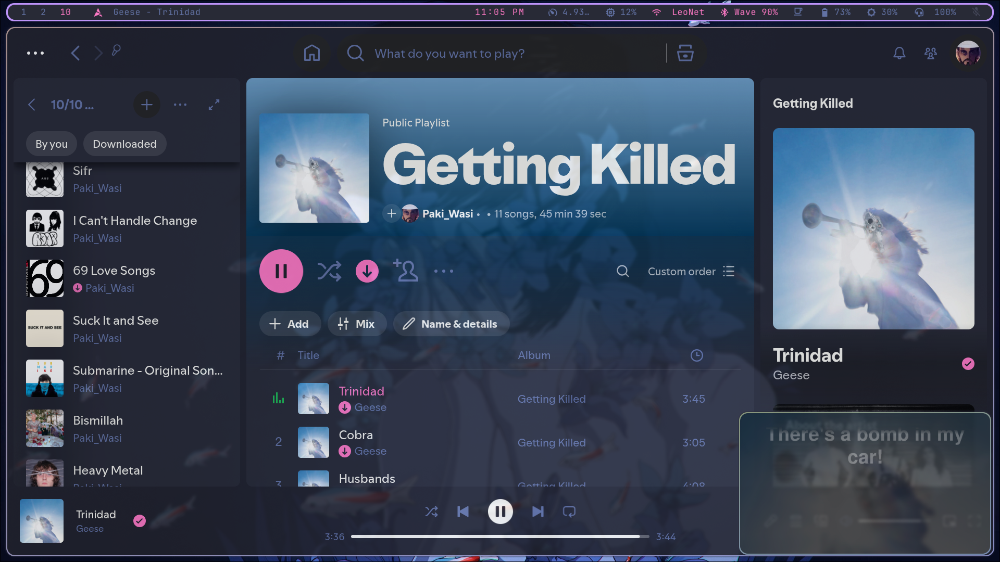

<div align="center">

# artixThinkpad-dots

My lean **Artix Linux** (dinit) setup on a ThinkPad E14, running **Hyprland**.



</div>

## Setup

| | |
|---|---|
| **OS / init** | Artix Linux / dinit |
| **WM** | Hyprland (Lua config) |
| **Bar / notifs / launcher** | Waybar / mako / fuzzel |
| **Lock / idle** | hyprlock / hypridle |
| **Terminal** | kitty + tmux |
| **Shell** | zsh + starship |
| **Editor** | Neovim (native `vim.pack`) |
| **Keyboard** | kanata (as a dinit service) |
| **Browser / files / music** | Zen / Thunar / Spotify (spicetify) |
| **Theme** | Dracula, JetBrains Mono |

## Showcase

<table>
  <tr>
    <td></td>
    <td></td>
  </tr>
  <tr>
    <td></td>
    <td></td>
  </tr>
  <tr>
    <td></td>
    <td></td>
  </tr>
</table>

<details>
<summary>More</summary>





</details>

## Notes

- Random wallpaper on login from `Pictures/Wallpapers`.
- `fetch` shows fastfetch with a random image from `Pictures/Pfps`.
- Zsh lives in `~/.config/zsh` (`.zshenv` sets `ZDOTDIR`).

## Install

The repo mirrors `$HOME`.

```sh
git clone https://github.com/PAKIWASI/artixThinkpad-dots.git
cd artixThinkpad-dots
```

Copy or symlink what you want into `~`. Back up your existing configs first.
